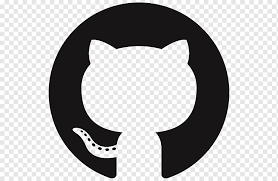

<!-- Comentario ctrl + k + c
  -->

<!-- 
   
    

# Cabeçalho  Markdowm
###### Cabeçalho Markdowm

<h1>Cabeçalho </h1>

<h6>Cabeçalho </h6> -->

## Descrição do Projeto

  

 Pensando mais a longo prazo, a revolução dos costumes apresenta tendências no sentido de aprovar a manutenção de alternativas às soluções ortodoxas. No mundo atual, a complexidade dos estudos efetuados estende o alcance e a importância do remanejamento dos quadros funcionais.

## Tabela de conteúdo

<ul id= "menu"> 
    <li><a href="#">Descrição do projeto</a></li>
</ul>